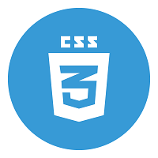

# Html5 e Css3
 
<strong>Descrição fácil e detalhada de vários tópicos sobre HTML5 e CSS3.</strong>

 

 
 
 
Repositório em andamento.

 
Este repositório e outros que venham a ser criados são obra das aulas do Professor Gustavo Guanabara, com o seu curso de Git-GitHub, HTML-CSS, entre outros...

 <ul>
 <li><a href="https://www.youtube.com/cursoemvideo">Canal do Curso em Vídeo</a></li>
 <li><a href="https://www.instagram.com/gustavoguanabara/">Perfil do Instagram de Gustavo Guanabara</a></li>
 <li><a href="https://www.instagram.com/cursoemvideo">Perfil do Instagram do Curso em vídeo</a></li>
 </ul>
